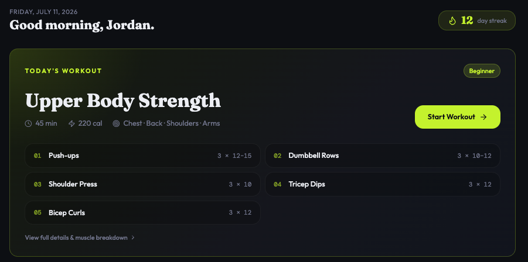
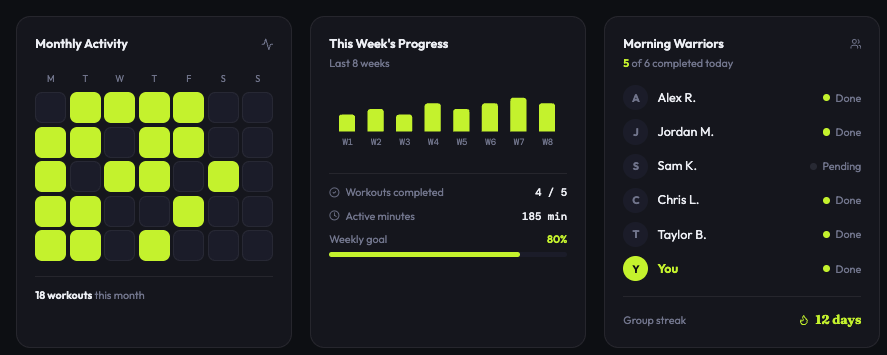
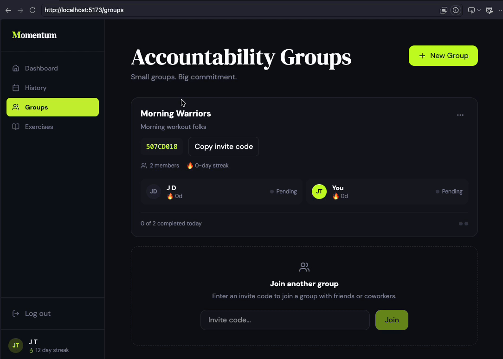
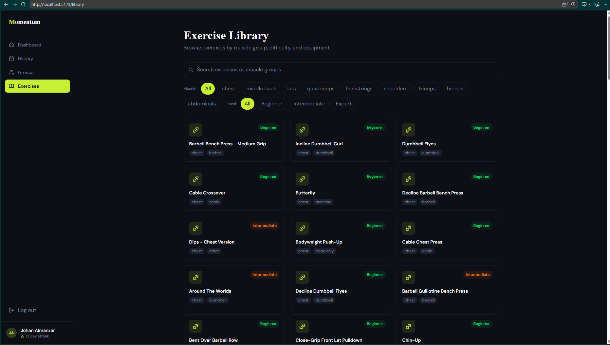
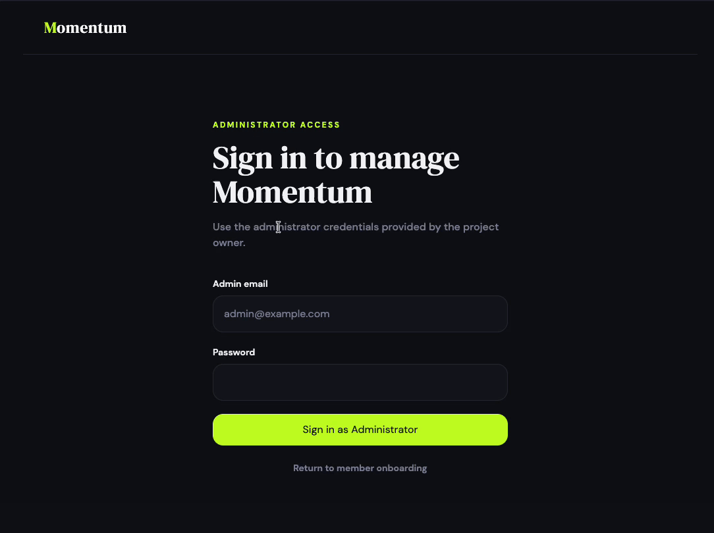
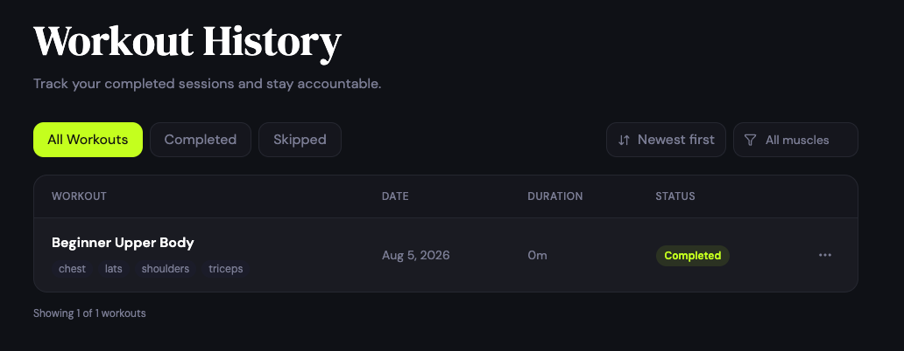

# Momentum

CodePath WEB103 Final Project

Designed and developed by Kritazya Upreti, Johan Almanzar, Ngoc (Vy) Pham,
and Joy Tran.

- Deployed site: https://momentum-av8u.onrender.com

Momentum is a full-stack fitness consistency platform designed to help
beginners and casual gym-goers build sustainable workout habits. It combines
guided onboarding, workout tracking, and small accountability groups so users
can focus on consistency instead of planning every detail themselves.

## Tech stack

### Frontend

The app emphasizes long-term consistency over perfection. Users can track their progress through workout history, streaks, and personalized motivational insights while participating in small accountability groups that encourage members to stay committed without the distractions of a traditional social media platform.

Our goal is to make working out feel simple, approachable, and rewarding so that users develop lasting fitness habits.

---

## Inspiration

Many fitness apps assume users already know how to structure workouts, understand proper training splits, or stay motivated independently. For beginners, this often creates analysis paralysis and causes them to lose consistency before building a routine.

Momentum is inspired by habit-building products such as Duolingo and GitHub contribution streaks, combined with the simplicity of having a personal coach who tells you exactly what to do each day. Instead of rewarding users for lifting the most weight, Momentum celebrates consistency, progress, and small daily victories.

---

## Tech stack

### Frontend

- React
- React Router
- Tailwind CSS
- Vite

### Backend

- Node.js
- Express
- PostgreSQL
- JWT authentication in httpOnly cookies

## Completed features

### ✅ Personalized onboarding

Members complete a multi-step form that collects their profile, fitness goal,
experience level, workout location, equipment, and weekly commitment. The
server validates submitted values before saving them and authenticates the new
member with an httpOnly cookie.

https://github.com/user-attachments/assets/5eeecaef-6076-4e73-8bdc-24f106df94a4

### ✅ Daily Workout Generator

Authenticated members can create a group, receive an invite code, join another
group, see member streak and daily-completion information, and leave a group.
Group administrators can update or delete only groups they administer.



### ✅ Workout Progress Dashboard

<!-- TODO: Replace this comment with the uploaded administrator GIF. -->



### ✅ Workout History Management

Users can view, update, and remove completed workout logs, allowing them to maintain an accurate record of their fitness progress.


### ✅ Accountability groups

Authenticated members can create a group, receive an invite code, join another
group, see member streak and daily-completion information, and leave a group.
Group administrators can update or delete only groups they administer.



### ✅ Exercise Library

Users can loads exercises from the server, supports search, muscle filtering It also displays equipment and difficulty.



### ✅ Administrator authentication and authorization (Stretch feature)

Administrators can log in with server-validated credentials. Protected
exercise mutations require both a valid authentication cookie and the
administrator role.



### ✅ Workout-history filtering and detail modal (Custom Feature)

The workout-history interface supports status and muscle filters, date sorting,
pagination, responsive table/card views, error states, and a same-page workout
detail modal.


## Local installation

### ✅ Exercise Library

Users can browse a searchable exercise database containing exercise descriptions, target muscle groups, difficulty levels, and equipment requirements.


---

### ✅Workout Filtering & Sorting (Custom Feature)

Users can filter workouts by duration, muscle group, equipment, or difficulty and sort workouts based on recency or completion status.




---

# Stretch Features

- ✅ User authentication using JWT
    - Authentication uses signed JWTs stored in httpOnly cookies.
    - Member login, onboarding authentication, admin login, logout, and current-user lookup exist.

- ✅ Loading indicators
    - Dashboard cards use loading skeletons.
    - Exercise Library uses a loading spinner.
    - History, groups, authentication, and workout pages show loading states.

- ✅ Disable buttons during form submissions
    - Onboarding, login, admin login, group creation, and group joining prevent duplicate submissions.

---

# Installation Instructions

## Features still in progress

- Connecting the dashboard prototype to live API data
- Completing the Exercise Library interface
- Generating personalized daily workouts and starter plans
- Adding complete frontend controls for workout creation, updates, and deletion

These features are intentionally not presented as completed grading features.

## Database relationships

Momentum includes:

- One-to-many: one user has many workout sessions.
- Many-to-many: users belong to accountability groups through `GroupMembers`.
- Many-to-many: workout templates contain exercises through
  `WorkoutTemplateExercises`.
- Unique join-table membership: `UNIQUE(group_id, user_id)` prevents duplicate
  accountability-group membership.

## API highlights

- RESTful GET, POST, PATCH, and DELETE endpoints for users, exercises, workout
  templates, workout sessions, and accountability groups.
- Custom `POST /api/groups/join` endpoint for invite-code membership.
- Server-side onboarding validation with safe error responses.
- Authenticated identity derived from a signed cookie instead of browser-sent
  user IDs.
- Group-level authorization through `GroupMembers.is_admin`.

## Local installation

1. Clone the repository and install dependencies.

```bash
git clone <repository-url>
cd MOMENTUM/client
npm install
cd ../server
npm install
```

2. Create `server/.env` with the required local values.

```env
PGUSER=your_postgres_user
PGPASSWORD=your_postgres_password
PGHOST=localhost
PGPORT=5432
PGDATABASE=your_database
PGSSL=false
JWT_SECRET=replace_with_a_long_random_secret
ADMIN_USERNAME=admin
ADMIN_FIRST_NAME=Momentum
ADMIN_LAST_NAME=Admin
ADMIN_EMAIL=admin@example.com
ADMIN_PASSWORD=replace_with_a_secure_password
CLIENT_URL=http://localhost:5173
```

3. Reset and seed the local database intentionally.

```bash
cd server
npm run reset
```

This command deletes existing application data. Do not use it against a
production database.

4. Start the backend.


5. In another terminal, start the frontend.

```bash
cd client
npm run dev
```

6. Open http://localhost:5173.

## Render configuration

### Server Web Service

```text
Root Directory: server
Build Command: npm install
Start Command: npm run reset & npm run start
Health Check: /api/health
```

Required environment variables include `DATABASE_URL`, `JWT_SECRET`,
`CLIENT_URL`, `NODE_ENV=production`, and the administrator seed values when
running the reset command intentionally.

### Client Static Site

```text
Root Directory: client
Build Command: npm install && npm run dev
Publish Directory: dist
VITE_API_URL=https://momentum-bxgh.onrender.com
```


## Final walkthrough

https://www.loom.com/share/afab2e6ad9744cc896aa283a8c1d3f4c
