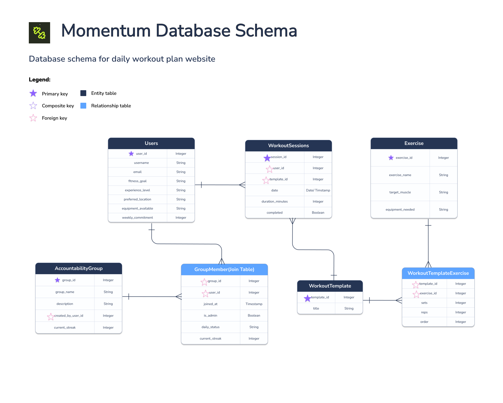

# Entity Relationship Diagram

Reference the Creating an Entity Relationship Diagram final project guide in the course portal for more information about how to complete this deliverable.

## Create the List of Tables

Our database consists of 4 main entity tables, 1 dynamic tracking table, and 2 junction tables. This structure supports automated workout plan generation based on onboarding preferences, history tracking, and group streaks:

- **`users` (Entity):** Stores unique user profile information and fitness criteria collected from the 5-step onboarding questionnaire.
- **`workout_sessions` (Dynamic History Entity):** Tracks executed workout routines, acting as the log to power weekly stats and the GitHub-style contribution grid.
- **`workout_templates` (Entity):** Stores master metadata for our pre-built workout routines (e.g., "Beginner Upper Body").
- **`workout_template_exercises` (Junction Table):** Maps exercises to workout templates with specific sets, reps, and sequencing order.
- **`accountability_groups` (Entity):** Tracks the metadata for distinct, user-created physical accountability circles.
- **`group_members` (Junction Table):** Bridges users and accountability groups, managing roles, daily statuses, and individual group streaks.
- **`exercises` (Standalone Catalog):** A master reference library of individual physical movements.

---

## Add the Entity Relationship Diagram

### Table Structures

#### 1. users

| Column Name           | Type         | Description                                                |
| :-------------------- | :----------- | :--------------------------------------------------------- |
| `user_id`             | serial       | primary key                                                |
| `username`            | varchar(50)  | unique display name of the user                            |
| `first_name`          | varchar(50)  | required first name of the user                            |
| `last_name`           | varchar(50)  | required last name of the user                             |
| `email`               | varchar(100) | unique email address used for identification               |
| `fitness_goal`        | varchar(50)  | primary objective from onboarding (e.g., 'Build Muscle')   |
| `experience_level`    | varchar(30)  | training background from onboarding (e.g., 'Intermediate') |
| `equipment_available` | varchar(50)  | available user fitness equipment                           |
| `weekly_commitment`   | integer      | number of days per week the user commits to train          |

#### 2. workout_sessions

| Column Name        | Type    | Description                                                                                  |
| :----------------- | :------ | :------------------------------------------------------------------------------------------- |
| `session_id`       | serial  | primary key                                                                                  |
| `user_id`          | integer | required foreign key pointing to users.user_id; unique together with template_id             |
| `template_id`      | integer | required foreign key pointing to workout_templates.template_id; unique together with user_id |
| `date`             | date    | required calendar date the training session took place                                       |
| `duration_minutes` | integer | required total length of the session in minutes (for weekly tracking stats)                  |
| `completed`        | boolean | required flag identifying if the session was successfully checked off; defaults to false     |

#### 3. workout_templates

| Column Name   | Type         | Description                                                           |
| :------------ | :----------- | :-------------------------------------------------------------------- |
| `template_id` | serial       | primary key                                                           |
| `title`       | varchar(100) | required name of the structured routine (e.g., 'Beginner Upper Body') |

#### 4. workout_template_exercises (Junction Table)

| Column Name      | Type    | Description                                                                                       |
| :--------------- | :------ | :------------------------------------------------------------------------------------------------ |
| `template_id`    | integer | required foreign key pointing to workout_templates.template_id; part of the composite primary key |
| `exercise_id`    | integer | required foreign key pointing to exercises.exercise_id; part of the composite primary key         |
| `sets`           | integer | required target number of sets to execute                                                         |
| `reps`           | integer | required target number of reps per set                                                            |
| `exercise_order` | integer | required sequence index of the movement in the workout                                            |

#### 5. accountability_groups

| Column Name          | Type         | Description                                                                             |
| :------------------- | :----------- | :-------------------------------------------------------------------------------------- |
| `group_id`           | serial       | primary key                                                                             |
| `group_name`         | varchar(100) | required title of the accountability group circle                                       |
| `description`        | text         | short bio explaining the purpose or target of the group                                 |
| `created_by_user_id` | integer      | foreign key pointing to users.user_id (group owner)                                     |
| `current_streak`     | integer      | cumulative daily consecutive tracking streak metric for the entire group; defaults to 0 |

#### 6. group_members (Many-to-Many Junction Table)

| Column Name      | Type        | Description                                                                                   |
| :--------------- | :---------- | :-------------------------------------------------------------------------------------------- |
| `member_id`      | serial      | primary key                                                                                   |
| `group_id`       | integer     | required foreign key pointing to accountability_groups.group_id; unique together with user_id |
| `user_id`        | integer     | required foreign key pointing to users.user_id; unique together with group_id                 |
| `joined_at`      | timestamp   | timestamp when the user joined the accountability squad; defaults to the current timestamp    |
| `is_admin`       | boolean     | flag identifying if the user has administrative privileges; defaults to false                 |
| `daily_status`   | varchar(20) | explicit daily checking status identifier ('Done' or 'Pending')                               |
| `current_streak` | integer     | individual workout consistency streak inside this group; defaults to 0                        |

#### 7. exercises (Standalone Table)

| Column Name        | Type         | Description                                               |
| :----------------- | :----------- | :-------------------------------------------------------- |
| `exercise_id`      | serial       | primary key                                               |
| `exercise_name`    | varchar(100) | required name of the physical exercise (e.g., 'Squat')    |
| `target_muscle`    | varchar(50)  | core anatomical muscle targeted by the movement           |
| `equipment_needed` | varchar(50)  | primary mechanical equipment required to execute the lift |
| `difficulty`       | varchar(30)  | difficulty level of the exercise                          |
